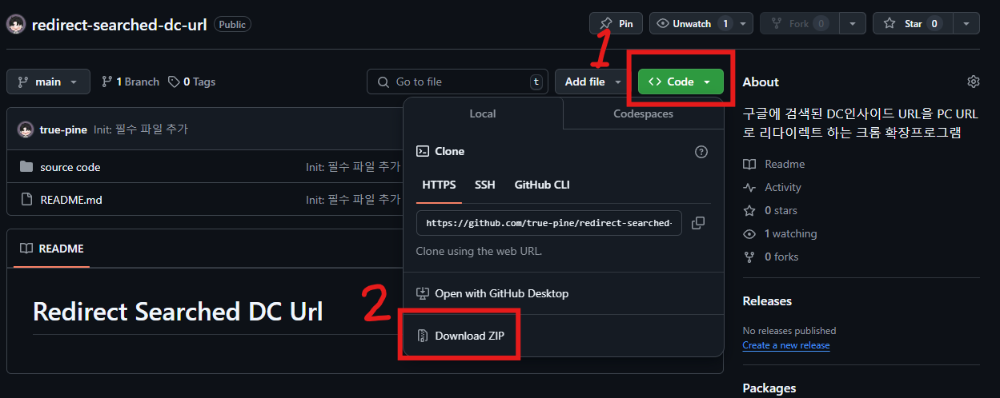
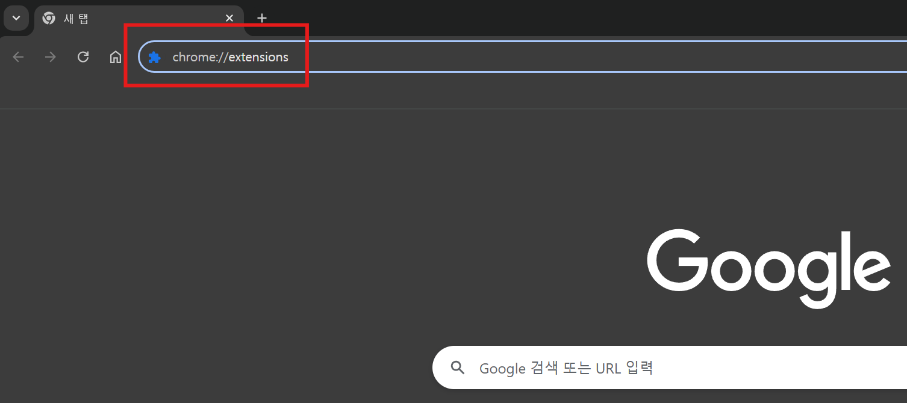
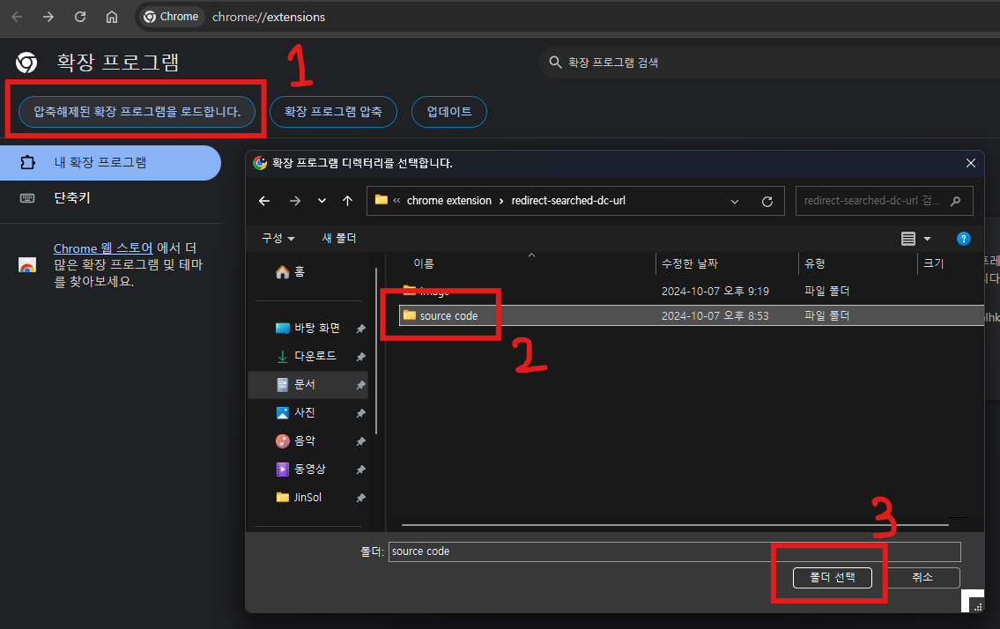
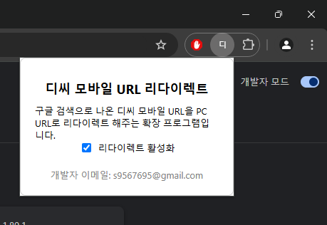
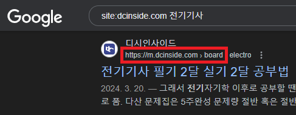

# 사용방법
### 1. 파일 다운 받고 압축풀기

### 2. 크롬을 실행하고 주소창에 `chrome://extensions/` 입력 후 Enter

### 3. `source code` 폴더를 크롬에 업로드하기

### 4. 기능 활성화

# 주의사항

url이 `https://m.dcinside.com > board`로 시작하지 않으면 리다이렉트가 되지 않습니다.

이 부분은 차후 url을 파싱하고 수정하는 부분을 추가하도록 하겠습니다.</spen>